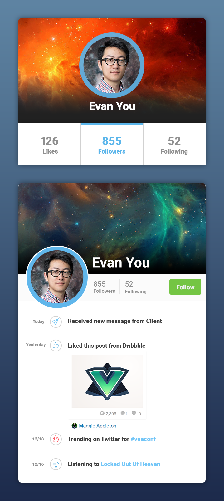

# Frontend Developer Test

If you are applying for a backend specific role with no frontend expectations, you can skip this folder's challenges.

## Challenge #1: Markup and Styles

This challenge is focused on skills surrounding HTML/CSS, like layout, browser compatibility, and organization.

### Requirements:

* Write markup and styles to reproduce `user-summary.png` and `user-detail.png` as accurately as you can.
* The two images you reproduce can be shown simultaneously on the screen or one at a time with some form of interaction to switch between them.
* Create a new file called `challenge1.html`, this will be where the markup for this challenge should live.
* Create your own folder and file structure as needed so long as it stays inside the `/frontend` folder.
* When you hover over the user's avatar, an animation should occur.
* When you hover over the "Follow" button, the button color should change.
* Your code should run without errors in latest version of Chrome, Firefox, Edge, Safari, and Internet Explorer 11.

### Notes:

* Use any tools or libraries you wish or none at all.
* You may use any pre or post processing tools for your styles or just plain CSS.
* The `/assets` folder contains image assets formatted in multiple different ways, use whatever version you are comfortable with, or create your own.
* The only font used in the images is `Roboto`.
* Writing tests is not required for this challenge.

## Challenge #2: DOM/Browser JS

This challenge is to test browser specific knowledge of JavaScript.

* Open `challenge2.html` and follow the instructions.
* Writing tests is not required for this challenge.
